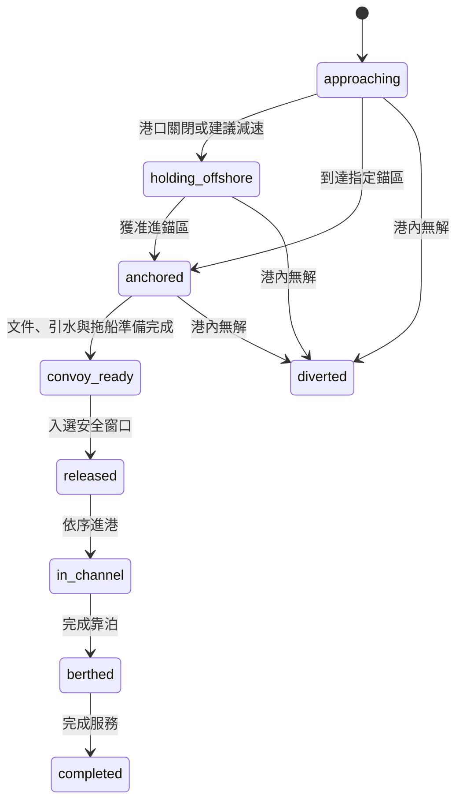

# 系統規格：安全衝擊與商軍泊位重分配

狀態：第一版開發基準  
日期：2026-07-28

## 1. 定位與邊界

本系統是「戰時／全災害港口商船重分配決策支援與 What-if 數位孿生推演系統」。

使用者輸入泊位受損、占用、徵用、保留、作業窗口及軍事任務需求；系統在安全限制與
不可降低的軍事優先要求下，產生多個可行的商船重分配方案及其代價。

系統不：

- 預測攻擊、受損目標或軍方會徵用哪些泊位；
- 自動降低、取消或延後使用者輸入的不可延誤軍事任務；
- 發布 VTS、港務或軍事命令；
- 把公開資料上的 PoC 結果表述為真實港方戰時績效。

決策分兩層：

1. 高雄港內：批次選船、進港順序、泊位與資源重分配。
2. 港內無可行解：錨地等待、延後到港、減速到港，再評估跨港分流。

台中／基隆分流在取得等價資料前只保留介面，不作真實容量宣稱。

## 2. 三種使用視角

### 軍方

- 任務是否準時完成；
- 必須保留的泊位、窗口及資源；
- 預定優先排程偏離；
- 軍用泊位受損時的備援；
- 完成軍事任務後的商港干擾。

### 港口

- 受影響船舶、相容替代泊位與無解原因；
- 全港等待、錨地佇列、makespan、服務船次與泊位利用率；
- 回復 70%、90%、100% 服務能力所需時間；
- FCFS、公開優先規則、VTS 規則仿真與 NSGA-II 的配對比較；
- 需要等待、延後或跨港的船舶。

### 船舶

- 原泊位、替代泊位與新 ETA／ETB；
- 留在錨地、港外等待、減速、延後到港或跨港的建議；
- 改泊、改港與延誤成本；
- 可追溯的改派理由及每個輸入的 provenance。

解釋範例：

> V023 原定 68 號泊位；該泊位停用 48 小時。69 號泊位符合水深與長度限制，
> 但 14:30 前被占用，因此建議 14:45 改靠，預估增加等待 4.2 小時。

## 3. 核心情境：由串流轉為安全窗口批次

平時船舶依 ETA、引水與泊位狀態陸續申請及進港。戰時 preset 可把航道改成安全窗口：
船舶在航途中、港外或錨地等待，只能在指定窗口取得放行資格。

「批次放行」不表示多艘船同時進入狹窄航道。求解器必須在每個窗口內安排：

1. 本批必須進入的軍事任務船；
2. 剩餘容量可接納的商船；
3. 每艘船的逐艘進港順序與安全 headway；
4. 可用泊位及靠泊開始時間；
5. 引水、拖船與航道容量。

沒有被選入本批的船舶可：

- `anchored`：在指定錨區等待；
- `holding_offshore`：港外等待；
- `approaching`：依建議速度延後抵達；
- `diverted`：分流至其他港口。

錨地不是無限緩衝區。達到容量上限後，尚未抵達船舶應優先收到延後／減速到港建議。

## 4. 船舶狀態機

## 5. 泊位狀態

- `normal`
- `commercial_occupied`
- `military_occupied`
- `military_reserved`
- `fully_damaged`
- `partially_damaged`
- `under_repair`

事件包含開始時間、預計持續時間、容量損失比例、是否立即清空、是否允許原靠泊船完成，
以及 `instant`、`staged`、`unknown` 修復曲線。相同泊位可同時存在不同來源事件，最後可用
容量取所有硬限制交集，不可用簡單 last-write-wins 覆蓋。

## 6. 輸入與 provenance

### 泊位

編號、群組、terminal、長度、水深、用途、可處理船／貨種、占用區間、受損／徵用／
保留事件、作業時窗、航道、拖船與引水容量。

### 船舶

ID、ETA、GT、LOA、吃水、船種、原泊位、服務時間、軍方／商船身分、任務或貨物優先、
deadline、是否可延後、是否可跨港。

每個非純識別欄位應標示：

- `observed`
- `estimated`
- `scenario_input`

### 情境

受損／占用事件、安全窗口、每窗最大放行數、窗口內 headway、到港率倍率、夜間停工、
拖船／引水縮減、錨地容量與跨港接收容量。

## 7. 求解與動態更新

- NSGA-II：主求解器，回傳 Pareto 候選；
- CP-SAT：縮小實例精確驗證；
- FCFS：最弱基準；
- 公開優先權規則：船種、潮汐、大船等；
- VTS 規則仿真：rolling rounds、單向航道、headway、拖船及引水限制。

NSGA-II／CP-SAT 不需要訓練。每當泊位、船舶、窗口或資源改變，前端送出新的完整
snapshot，後端以 rolling／receding horizon 重新求解。已開始或已核准且進入 freeze
horizon 的動作應鎖定，避免每次更新造成不可執行的排程抖動。

## 8. 硬限制與目標

硬限制：

- 受損、徵用或軍方保留泊位不可被不合格船舶使用；
- 長度、吃水、用途、terminal 或設備不相容；
- 泊位時間重疊；
- 航道 headway、拖船、引水或安全窗口容量超限；
- 不可延誤軍事任務未完成；
- 已開始／已承諾且位於 freeze horizon 的動作被任意撤銷。

第一版三目標：

1. 軍方預定優先排程偏離；
2. 商船總等待時間；
3. 全港 makespan。

權重 profile 只排序 Pareto 候選，不改變硬限制：

- 軍方優先：`[0.70, 0.20, 0.10]`
- 港口韌性：`[0.30, 0.50, 0.20]`
- 商船友善：`[0.30, 0.20, 0.50]`
- 均衡：`[0.34, 0.33, 0.33]`

評估 KPI：

- 軍事任務準時完成率；
- 每窗口放行與未放行船數；
- 完成服務船次；
- 商船平均／P90 等待；
- 錨地最大佇列；
- 泊位、拖船及引水瞬間負載；
- 改泊、延後與跨港船數；
- 累積服務能力損失；
- 回復 90% 服務能力時間；
- constraint violations 與求解時間。

## 9. 第一版驗收劇本

1. 載入 72 小時高雄港 snapshot。
2. 點選 68 號泊位，設定 10:00 起完全受損 48 小時。
3. 系統標示靠泊中、convoy-ready 及未來預報的受影響船。
4. 12:00 安全窗口重新求解，列出 69／70 號等候選泊位與不可行原因。
5. 同時執行 FCFS、VTS 規則仿真與 NSGA-II。
6. 切換軍方、港口與船舶視角，選擇 Pareto 方案。
7. 播放事件日誌；模擬途中再關閉另一泊位。
8. 凍結已進航道的船，只重排尚未執行部分。
9. 顯示新 Pareto、KPI 差異及每艘船的改派解釋。

驗收時應明確標示哪些欄位為 observed、estimated 或 scenario_input。
