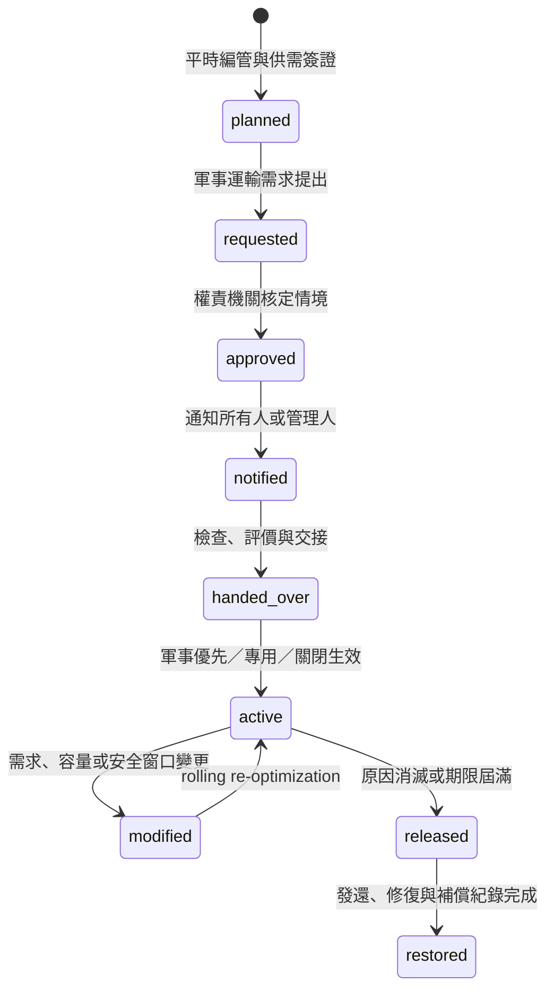

# 戰時港口徵用：公開制度研究與模擬轉譯

更新日期：2026-07-28

本文件只整理公開法規與官方制度，用於高階資源與排程 what-if。它不描述特定作戰計畫、
港口弱點、攻擊目標或未公開 SOP。

## 結論

公開制度較接近「分層、分範圍的軍事優先與動員管制」，不是一發生戰事就假設整座商港
永久關閉。可被動員或徵用的對象至少分成：

1. 港口固定設施；
2. 個別泊位、裝卸機具、倉儲與相關作業能力；
3. 商用船舶、漁船及其船員；
4. 引水、拖船、航道與內陸接轉等運輸能力；
5. 操作上述財物所需的人員。

戰時軍事運輸對港口具有優先使用權，但「優先」不等於所有情境都必須完全清港。公開規範
同時要求審查運量／運能、指定港口開閉時間、船舶集結、預先分配靠泊地點與裝卸機具，並
處理倉儲、安檢通關及內陸接轉。因此第一版應讓使用者選擇優先、時段保留、軍方專用或完全
關閉，而不是把「戰時」硬編碼為單一狀態。

## 台灣公開制度

### 平時整備

《船舶編管及運用辦法》要求依航港局四個航務中心轄區，對船舶及船員分類編管、定期調查與
異動校正；收到運用通知的船舶應盡量保持適航並依指定時間、地點報到。航港局公開職掌也明列
水運動員準備的擬訂及執行。

116–117 年度公開動員準備綱領進一步要求掌握船舶、設施、人員與維修量能，動態追蹤輸具，
並規劃戰時海運運補備援方案。這支持模型在情境開始前先建立 capability registry，而不是在
事件發生後才假設所有船、泊位和人員都可立即使用。

### 動員與指揮

《動員實施階段國軍機動運輸及軍品運補交通管制辦法》規定，由國防部、交通部、內政部、
各軍種及相關機關組成聯合運輸指揮部；地方另組聯合運輸指揮處。水運方面：

- 聯合運輸指揮部依軍事水運申請審查運量與運能，管制港口設施，戰時軍事需求有優先使用權；
- 航港局負責二十總噸以上商用船舶與民間水運機具整備及配合軍事運輸；
- 海軍負責艦船與已徵用船舶、機具的調派，以及軍港、商港、工業港、漁港的軍事運輸管制。

公開的航運管制規範也描述港口開閉時間、船舶編組與集結、靠泊地點、裝卸機具、倉儲、安檢
通關及內陸接轉的協調。這與目前「關閉期累積、指定安全窗口批次放行」模型一致，但開閉時間
和批次容量仍必須是使用者輸入，不能由系統自行宣稱。

### 徵用程序與解除

《全民防衛動員實施階段物資固定設施徵購徵用及補償實施辦法》顯示的公開程序是：

1. 國防部陳報行政院核定徵用時期與區域後發布實施命令；
2. 軍事機關或部隊與協調機關訂定需求計畫；
3. 原則上由軍事需求端提前十日簽發徵用書，執行機關提前五日送達；
4. 情況急迫時可以先行徵用，並於徵用後三日內補發書面；
5. 固定設施以現地方式檢查、評價與交接；徵用文件應記載期限；
6. 原因消滅後解除、發還，並依規定處理使用補償、修復、毀損或滅失補償。

上述通知時間適合做行政 lead-time 與稽核欄位，不宜作絕對排程硬限制，因為公開法規本身保留
急迫情況例外。

## 國外公開框架的共通點

美國 MARAD 的 National Port Readiness Network 以跨機關 Port Readiness Committee 協調
商港在國防緊急狀況下支援軍事部署；其 Strategic Seaports Program 明確以快速回應國防需求、
同時降低商業干擾為目標。GAO 的公開審查也把替代港口、設施缺陷及任務影響納入 readiness。

NATO 的公開 Host Nation Support 原則則強調軍民協調、有限民間資源的事前規劃、標準化程序
與動態調整。這些資料支持本專案保留多個可行候選，而不是只產生一個「軍方全拿」方案。

## 建議的模擬生命週期

## What-if 控制模式

| 模式 | 排程語意 | 是否可自動清空現有商船 |
|---|---|---|
| `military_priority` | 軍事任務先排；剩餘容量可供商船 | 否 |
| `capacity_reservation` | 指定時段保留部分窗口、拖船、引水或裝卸能力 | 否 |
| `military_exclusive` | 指定泊位／terminal 在時段內只供軍事任務 | 必須由使用者設定 |
| `closed` | 指定範圍對軍商船均不可用 | 必須由使用者設定 |
| `full_facility_requisition` | 全港或整個 terminal 交由動員管制 | 極端情境，需明確核准 |

`allow_current_vessel_to_finish`、`clear_before_start` 與所需緩衝時間沒有從公開法規得到單一答案，
必須保留為人工情境輸入。

## 軍事需求資料欄位

每個軍事任務至少需要：

- 任務 ID、船舶 ID 與 `scenario_input` authority；
- ready time、planned start、hard deadline、服務時間；
- LOA、吃水、用途／貨類、相容 terminal／泊位；
- 是否需要專用泊位、裝卸區或倉儲；
- 每個窗口所需引水、拖船、航道與裝卸資源；
- 是否可拆批、是否可移至替代港，以及誰有權核准變更。

每個港口管制事件至少需要：

- 核定狀態、發布／生效／解除時間；
- 控制模式、範圍與容量保留比例；
- 是否允許原靠泊船完成、是否要求清空；
- 補償與修復只作稽核 KPI，不進安全限制交換。

同時應保留基本民生與關鍵商業流的最低服務需求。公開動員法規本身同時關注軍事、工業及
基本民生供應，因此模型不應把所有未被軍方使用的容量視為可任意犧牲。

## 對目前程式的影響

目前 `resilience.military-input.v2` 已加入人工核定狀態與泊位層級、分時的
`military_priority`、`military_exclusive`、`closed` 控制，並保留 v1 任務檔相容性。後續仍應：

1. 擴充 terminal／全港範圍與百分比 capacity reservation；
2. 加入拖船、引水、裝卸與倉儲 resource reservation；
3. 加入 protected civilian flow；
4. 把通知、核定、交接、解除與補償寫入 event log；
5. 對沒有核定 authority 的控制只允許 preview，不可標成 approved plan。

## 官方來源

- [動員實施階段國軍機動運輸及軍品運補交通管制辦法](https://law.mnd.gov.tw/scp/Query4B.aspx?no=1A007717601)
- [全民防衛動員準備法](https://law.mnd.gov.tw/scp/Query4B.aspx?no=1A007706601)
- [全民防衛動員實施階段物資固定設施徵購徵用及補償實施辦法](https://law.mnd.gov.tw/scp/Query4B.aspx?media=1&no=1A007706607)
- [船舶編管及運用辦法](https://motclaw.motc.gov.tw/webMotcLaw2018/Law/Print?LawID=H0065001)
- [116–117 年度全民防衛動員準備綱領](https://adma.mnd.gov.tw/files/web/191/file_up/100006/1404/116-117%E5%B9%B4%E5%BA%A6%E5%8B%95%E5%93%A1%E6%BA%96%E5%82%99%E7%B6%B1%E9%A0%98.pdf)
- [交通部航港局船舶業務職掌](https://www.motcmpb.gov.tw/Article?nodeId=343&siteId=1)
- [MARAD National Port Readiness Network](https://www.maritime.dot.gov/ports/national-port-readiness-network-nprn)
- [MARAD Office of Sealift Support](https://www.maritime.dot.gov/national-security/strategic-sealift/office-sealift-support)
- [NATO Host Nation Support](https://www.nato.int/docu/logi-en/1997/lo-1206.htm)
